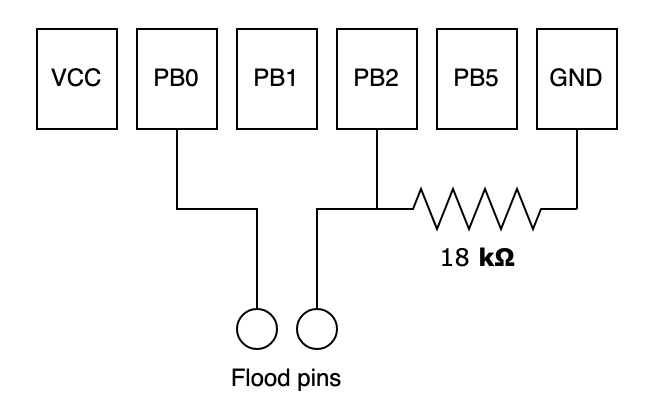

# Flood extension

Flood sensor can be plugged on v2 sensor programmation pins.

## Pin mapping

## Firmware

In [sensor.ino](../../../sensor.ino) uncomment `FLOOD_SENSOR_V2_ID` and choose the flood sensor ID.

